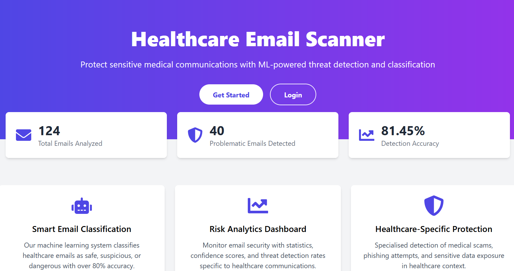
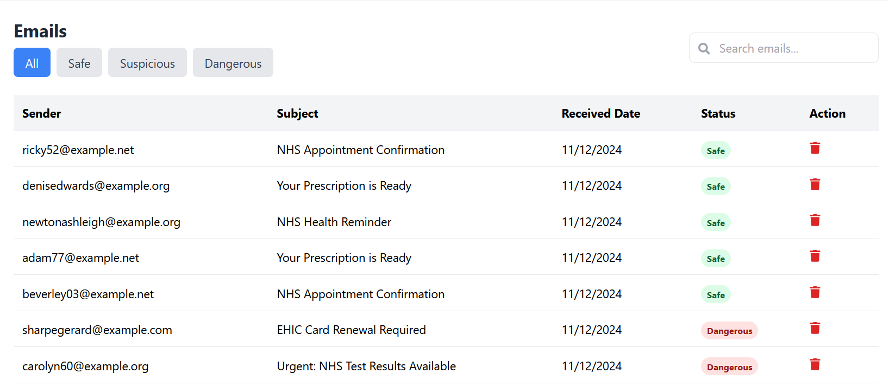
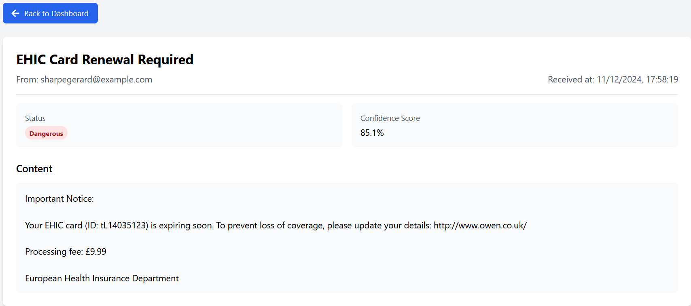
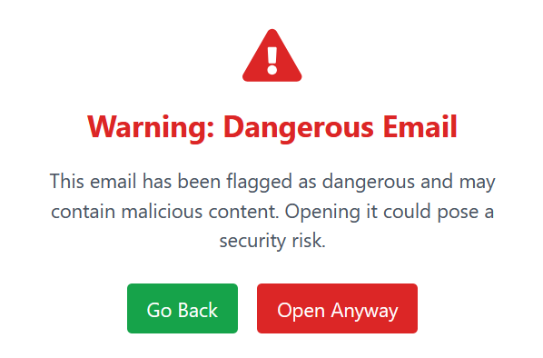

# Healthcare Email Scanner

[](https://www.typescriptlang.org/)
[](https://reactjs.org/)
[](https://www.djangoproject.com/)
[](https://tailwindcss.com/)
[](LICENSE)

A full-stack portfolio application that uses machine learning to scan and classify email communications in the context of healthcare.



## Key Features

### Intelligent Email Security
- **ML-Powered Classification**: Threat detection system categorising emails as safe, suspicious, or dangerous
- **Confidence Scoring**: Numerical risk assessment for each email
- **Healthcare-Specific Detection**: Specialised algorithms for identifying medical scams and sensitive data exposure
- **Import/Export Functionality**: Support for importing and exporting emails in the JSON format

### Analytics Dashboard
- **Email View**: List of emails with details
- **Filters and Search**: Filter emails by status, or search by key words



## Technologies

### Frontend
- React
- TypeScript
- Tailwind CSS

### Backend
- Django
- PostgreSQL

## Getting Started

### Prerequisites
- Python 3.10+
- Node.js 16+
- PostgreSQL

### Quick Start
1. Clone the repository
```bash
git clone https://github.com/vladcranga/healthcare-email-scanner.git
cd healthcare-email-scanner
```

2. Set up the backend
```bash
python -m venv venv
source venv/bin/activate  # or `venv\Scripts\activate` on Windows
pip install -r requirements.txt
python manage.py migrate
```

Create an .env file with the following variables:
```bash
DEBUG=True
SECRET_KEY=your-secret-key-here
DB_NAME=email_scanner
DB_USER=your-username
DB_PASSWORD=your-password
DB_HOST=localhost
DB_PORT=5432
```

3. Set up the frontend
```bash
cd frontend
npm install
npm run dev
```

## Technical Details

The machine learning model uses a combination of:
- Natural Language Processing for content analysis
- Pattern recognition for threat identification

## Screenshots

### Individual Email View


### Warning Message


## Contributing

Contributions are welcome! Please fork the repository and submit pull requests.

## License

This project is licensed under the MIT License.
